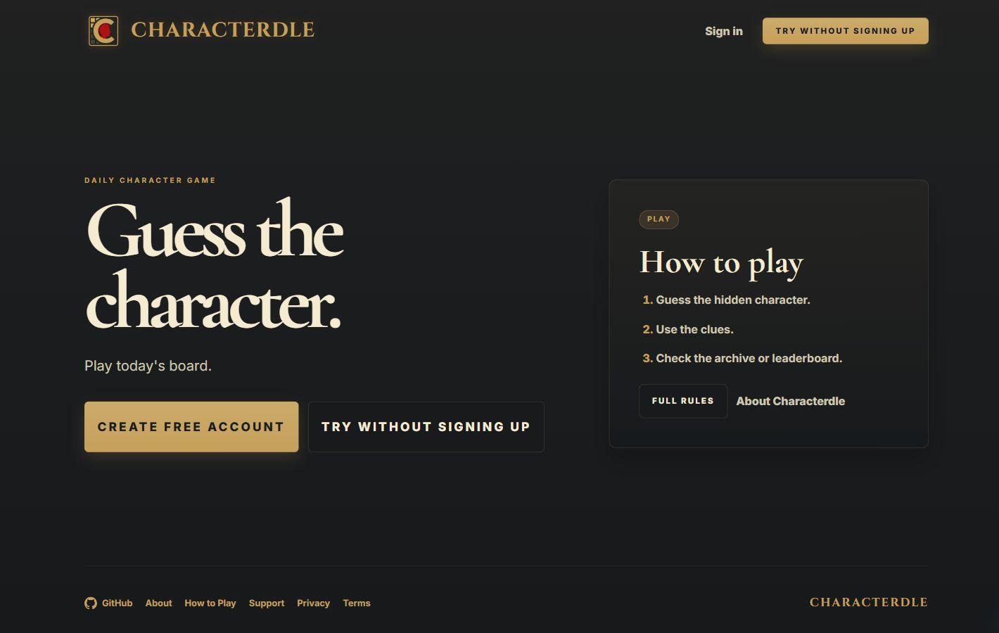
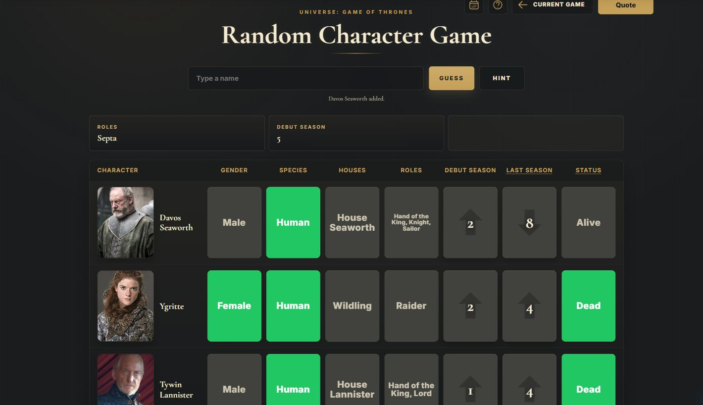
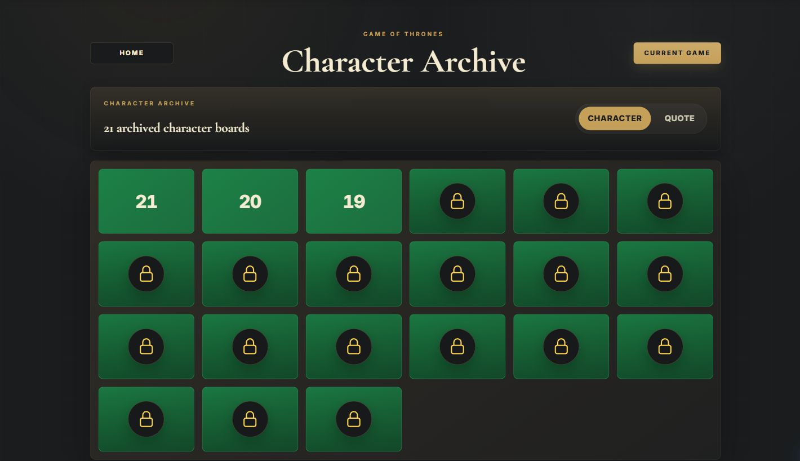
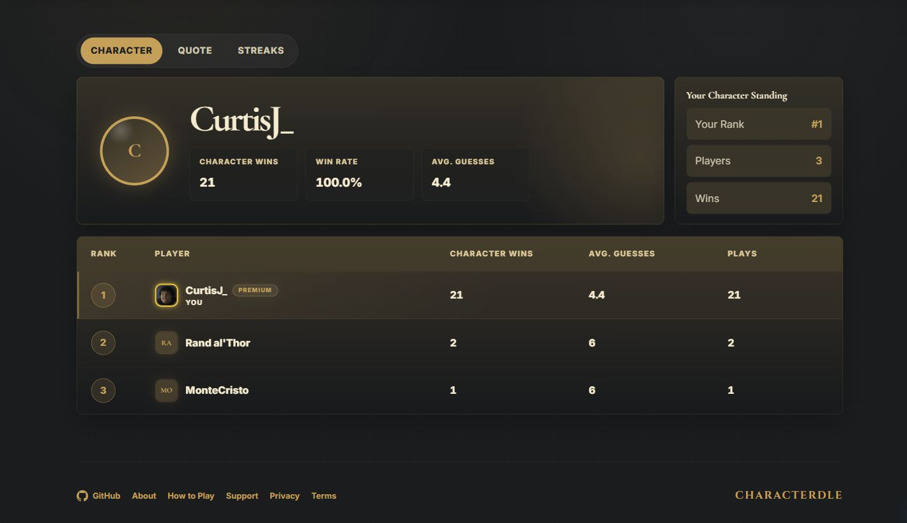

# Characterdle

[Characterdle](https://characterdle.com) is a full-stack daily guessing game built around fictional characters. The live experience currently focuses on **Game of Thrones**, with separate character and quote boards, account-backed progress, streaks, archives, leaderboards, and non-persistent practice rounds.

The repository is a portfolio-focused view of the product and the engineering behind it: a React and TypeScript client, an ASP.NET Core API, Supabase data and authentication, Stripe subscriptions, and production deployment through Cloudflare and Render.

## Product

- **Daily character game:** identify a hidden character through gender, species, house, role, season, and status comparisons.
- **Daily quote game:** identify a quote's speaker with progressive episode, role, and first-letter hints.
- **Player progression:** save results across devices, build daily streaks, review recent games, customize a profile, and compare character, quote, and streak leaderboards.
- **Archives:** browse every previous board; free accounts can replay the three most recent games and Premium unlocks the full history.
- **Random practice:** Premium members can generate unlimited temporary character and quote rounds directly from source content without affecting daily stats, streaks, archives, or analytics.
- **Premium membership:** Stripe-powered monthly and yearly subscriptions provide ad-free play, full archive access, random practice, streak protection, and supporter styling.
- **Accessible account flows:** email/password and Google sign-in, email confirmation, password recovery, profile management, and guarded account deletion.
- **Shareable results:** compact social results summarize guesses, hints, and streak progress without revealing the answer.

## Screenshots

### Landing Page



### Random Character Practice



### Character Archive



### Leaderboard



## Technical Architecture

### Frontend

- React 19, TypeScript 6, and Vite 8
- Path-based client routing with universe-scoped game, archive, leaderboard, profile, and random-practice routes
- Modular pages, hooks, services, and component-scoped styles
- Supabase browser authentication with email/password and Google OAuth
- Local board recovery plus a durable result outbox that retries authenticated submissions after network interruptions
- Guest victory migration when a player creates an account after completing a board
- Route-aware titles, descriptions, canonical URLs, Open Graph metadata, JSON-LD, sitemap generation, and public informational pages

### Backend

- ASP.NET Core Minimal APIs on .NET 10
- Direct PostgreSQL access through Npgsql
- Centralized Supabase bearer-token verification; protected APIs derive the user identity from the verified token rather than frontend-supplied IDs
- Daily game retrieval, archive access, random content selection, play analytics, profiles, result persistence, leaderboards, and streak calculation
- Eastern-time scheduling and catch-up logic with PostgreSQL advisory locking for safe daily game generation
- Server-enforced Premium access for full archives, random practice, billing, and streak savers
- Stripe Checkout, customer portal, signed webhooks, subscription-state synchronization, and one-time monthly-trial eligibility

### Data and Integrations

- **Supabase Postgres:** characters, quotes, daily games, results, profiles, premium status, and streaks
- **Supabase Auth:** sessions, Google OAuth, confirmation, and password recovery
- **Stripe:** monthly and yearly subscriptions, billing portal, and webhook-driven entitlements
- **Google AdSense:** advertising for eligible free sessions, suppressed for Premium members

## Notable Engineering Decisions

- Character and quote modes share reusable search, navigation, account, archive, and leaderboard infrastructure while preserving mode-specific rules and results.
- Universe definitions isolate character attributes and source tables so future universes can extend the platform without duplicating the full game flow.
- Random practice reads directly from character or quote source tables and never creates daily-game records or changes competitive statistics.
- Result submissions are idempotent and retryable, protecting completed games from transient API or hosting failures.
- Stripe webhooks are the source of truth for Premium state; account deletion is blocked while an active subscription still requires cancellation.
- Public content, legal pages, robots rules, and generated SEO assets are separated from private account and practice routes.

## Deployment

- **Frontend:** Cloudflare Workers Static Assets
- **Backend:** Dockerized ASP.NET Core service on Render
- **Database and authentication:** Supabase
- **Billing:** Stripe

The landing page warms the API and prefetches the current Game of Thrones board without blocking navigation, reducing the impact of a sleeping backend instance.

## Repository Layout

```text
Characterdle/
|-- Characterdle.Server/      # ASP.NET Core API, auth, games, billing, profiles, and scheduling
|-- characterdle.client/      # React application, routes, game UI, account flows, and SEO assets
|-- docs/screenshots/         # Current live-product screenshots used by this README
|-- render.yaml               # Render service definition
`-- Characterdle.slnx         # Visual Studio solution
```

Characterdle is a fan-made project and is not affiliated with or endorsed by HBO, Warner Bros. Discovery, George R. R. Martin, or related rights holders.
