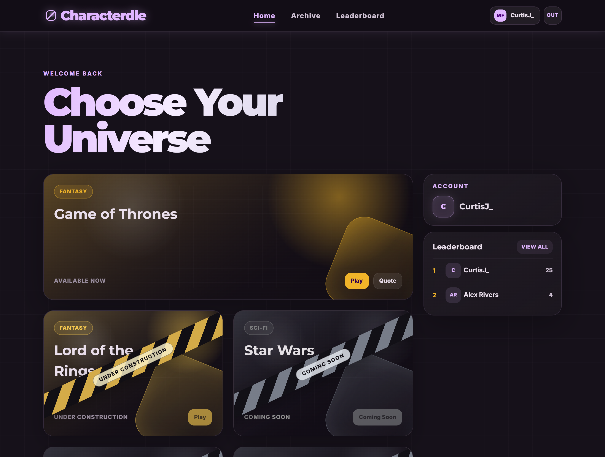
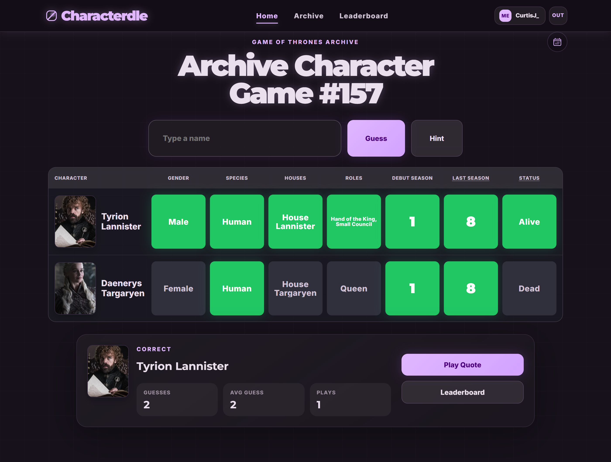

# Characterdle

Characterdle is a full-stack daily guessing game built around fictional characters, with **Game of Thrones** as the first live universe. The project combines game logic, account-backed progression, archives, leaderboards, and daily content rotation in a production-style web app.

This repository is intended to showcase the product, architecture, and technical work behind the project.

## Screenshots

### Landing Page


### Universe Launcher



### Daily Character Game



### Archive


### Leaderboard


## Project Overview

Characterdle is designed as a replayable daily game with two distinct modes:

- **Character Game:** guess the hidden character through attribute comparisons such as gender, species, house, role, debut season, last season, and status
- **Quote Game:** identify the speaker of a quote using a shared character search flow and progressive hints

The app also includes:

- Account-backed progress across devices
- Archive browsing for previous daily games
- Profile stats and global leaderboard ranking
- Admin/debug tooling for development and content management
- Daily game scheduling and automatic archive rollover

## Technical Highlights

- **Two linked but separate game modes**
  Character and quote boards share search, profile, leaderboard, and archive infrastructure, but maintain separate state, results, and ranking flows.

- **Hybrid persistence model**
  Completed game results are stored in Supabase for cross-device continuity, while richer per-board guess history is preserved locally when available.

- **Daily content lifecycle**
  The backend is responsible for current-game selection, archive history, and filling missed dates if the service was offline during a scheduled window.

- **Expandable universe model**
  The app is structured so additional universes can be added without rewriting the entire frontend flow. Universe metadata, game endpoints, and attribute definitions are modeled for extension.

- **Production-style frontend behavior**
  The client handles startup recovery, loading states, sleeping-backend wakeup behavior, auth flows, archive routing, and persistent game state.

## Architecture

### Frontend

- React
- TypeScript
- Vite

The frontend handles:

- Routing between landing, auth, launcher, game, archive, leaderboard, and profile views
- Character and quote game state
- Search suggestions and guess submission UX
- Local board-history persistence
- Auth session integration and account UI

### Backend

- ASP.NET Core
- C#

The backend handles:

- Game retrieval for active and archived boards
- Leaderboard and profile APIs
- Supabase-backed persistence
- Daily game scheduling and recovery logic
- Public runtime configuration for the client

### Data / Auth

- Supabase
- Postgres

Supabase is used for:

- Authentication
- Player profiles
- Game results
- Character and quote content
- Leaderboard queries

## Notable Product Behavior

- Character and quote leaderboards are tracked separately
- Hint usage makes a run unranked
- Archive tiles reflect completed games using account-backed result data
- Archived boards can still show solved outcomes even when detailed local guess history is unavailable
- Search prioritizes display-name matches first, then aliases, then last-name matches

## Tech Stack

- **Frontend:** React, TypeScript, Vite
- **Backend:** ASP.NET Core (.NET)
- **Database/Auth:** Supabase / Postgres
- **Hosting:** Cloudflare frontend, Render backend

## Repository Layout

```text
Characterdle/
|-- Characterdle.Server/      # ASP.NET Core API, scheduling, profiles, results, and game endpoints
|-- characterdle.client/      # React frontend, game UI, auth flows, archive, leaderboard, profile
|-- docs/screenshots/         # README images
`-- Characterdle.slnx         # Solution entry point
```

## Current Scope

The live product currently focuses on:

- **Universe:** Game of Thrones
- **Modes:** Character Game and Quote Game
- **Core systems:** auth, leaderboard, profile, archive, daily scheduling, and portrait-backed search

The codebase is intentionally structured to support future universes without replacing the underlying product flow.
