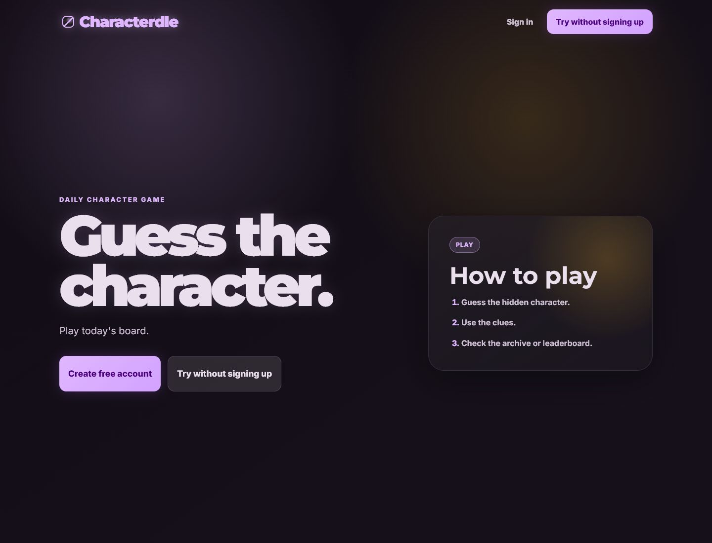
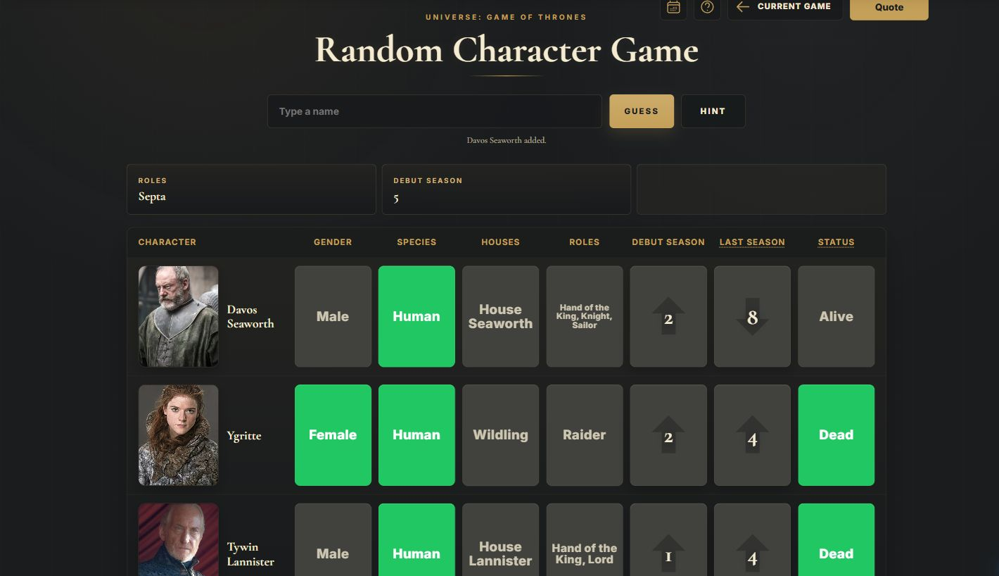
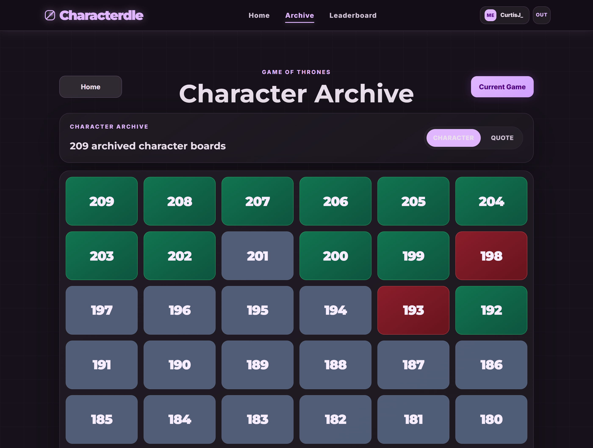
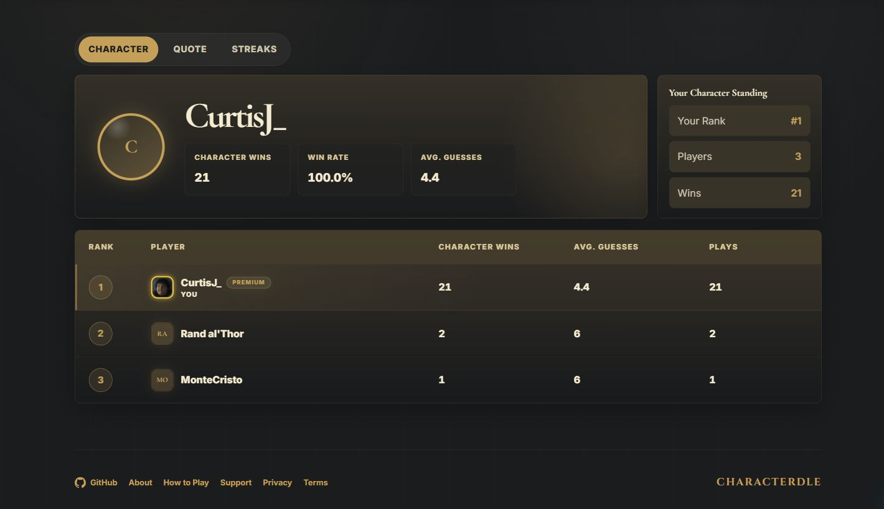

# Characterdle

[Characterdle](https://characterdle.com) is a full-stack daily guessing game built around fictional characters. The live experience currently focuses on **Game of Thrones**, with separate character and quote boards, account-backed progress, streaks, archives, leaderboards, and non-persistent practice rounds.

The repository is a portfolio-focused view of the product and the engineering behind it: a React and TypeScript client, an ASP.NET Core API, Supabase data and authentication, Stripe subscriptions, and production deployment through Cloudflare and Render.

## Product

- **Daily character game:** identify a hidden character through gender, species, house, role, season, and status comparisons.
- **Daily quote game:** identify a quote's speaker with progressive episode, role, and first-letter hints.
- **Player progression:** save results across devices, build daily streaks, review recent games, customize a profile, and compare character, quote, and streak leaderboards.
- **Archives:** browse every previous board; free accounts can replay the three most recent games and Premium unlocks the full history.
- **Random practice:** Premium members can generate unlimited temporary character and quote rounds directly from source content without affecting daily stats, streaks, archives, or analytics.
- **Premium membership:** Stripe-powered monthly and yearly subscriptions provide ad-free play, full archive access, random practice, streak protection, and supporter styling.
- **Accessible account flows:** email/password and Google sign-in, email confirmation, password recovery, profile management, and guarded account deletion.
- **Shareable results:** compact social results summarize guesses, hints, and streak progress without revealing the answer.

## Screenshots

### Landing Page



### Random Character Practice



### Character Archive



### Leaderboard



## Technical Architecture

### Frontend

- React 19, TypeScript 6, and Vite 8
- Path-based client routing with universe-scoped game, archive, leaderboard, profile, and random-practice routes
- Modular pages, hooks, services, and component-scoped styles
- Supabase browser authentication with email/password and Google OAuth
- Local board recovery plus a durable result outbox that retries authenticated submissions after network interruptions
- Guest victory migration when a player creates an account after completing a board
- Build-time HTML for all public sitemap pages, with titles, descriptions, canonicals, Open Graph metadata, and JSON-LD shared with the React client
- Request-time rendering of published updates through a Cloudflare Worker, so publishing or editing an announcement does not require a deployment

### Backend

- ASP.NET Core Minimal APIs on .NET 10
- Direct PostgreSQL access through Npgsql
- Centralized Supabase bearer-token verification; protected APIs derive the user identity from the verified token rather than frontend-supplied IDs
- Daily game retrieval, archive access, random content selection, play analytics, profiles, result persistence, leaderboards, and streak calculation
- Eastern-time scheduling and catch-up logic with PostgreSQL advisory locking for safe daily game generation
- Server-enforced Premium access for full archives, random practice, billing, and streak savers
- Stripe Checkout, customer portal, signed webhooks, subscription-state synchronization, and one-time monthly-trial eligibility

### Data and Integrations

- **Supabase Postgres:** characters, quotes, daily games, results, profiles, premium status, and streaks
- **Supabase Auth:** sessions, Google OAuth, confirmation, and password recovery
- **Stripe:** monthly and yearly subscriptions, billing portal, and webhook-driven entitlements
- **Google AdSense:** advertising for eligible free sessions, suppressed for Premium members

## Notable Engineering Decisions

- Character and quote modes share reusable search, navigation, account, archive, and leaderboard infrastructure while preserving mode-specific rules and results.
- Universe definitions isolate character attributes and source tables so future universes can extend the platform without duplicating the full game flow.
- Random practice reads directly from character or quote source tables and never creates daily-game records or changes competitive statistics.
- Result submissions are idempotent and retryable, protecting completed games from transient API or hosting failures.
- Stripe webhooks are the source of truth for Premium state; account deletion is blocked while an active subscription still requires cancellation.
- Public content, legal pages, robots rules, and generated SEO assets are separated from private account and practice routes.

## Deployment

- **Frontend:** Cloudflare Workers Static Assets plus a public-page Worker
- **Backend:** Dockerized ASP.NET Core service on Render
- **Database and authentication:** Supabase
- **Billing:** Stripe

The landing page warms the API and prefetches the current Game of Thrones board without blocking navigation, reducing the impact of a sleeping backend instance.

### Public HTML and SEO

Run `npm ci` and `npm run build` in `characterdle.client`. The build produces `dist/` (static assets and public HTML) and `dist-ssr/worker.js` (the Worker entry configured in `wrangler.jsonc`). Deploy with that configuration, not an assets-only upload. `npm run test:seo` checks the generated pages and Worker behavior after a build; `npx wrangler deploy --dry-run` validates packaging without deploying.

The Worker uses the existing build-time `VITE_API_BASE_URL` to read only the public announcements API. It does not forward visitor cookies or authorization, render private data, or query game answers. Published posts use the same safe Markdown components as the browser. Missing posts return 404; an unavailable announcements API returns a retryable 503 without taking other public pages down.

Set `VITE_DEPLOYMENT_ENVIRONMENT=staging` for staging builds. This writes noindex metadata into the generated HTML; private account, admin, and random-practice routes also return noindex. Gameplay, authentication, billing, and live leaderboard data still load through the existing React app and API. Public page content stays visible while the app starts.

Before promoting this change, verify the staging Worker serves page-specific HTML with JavaScript disabled, test a newly published update without rebuilding, and smoke-test sign-in, game navigation, and the existing billing-return flow. No database migration is required for rendering.

## Release Workflow

Characterdle uses a branch-based continuous-delivery workflow so changes can be exercised without putting the live game, accounts, or billing flow at risk.

- **Local development:** uses staging credentials and fails closed if configured with the production Supabase project or a live Stripe secret.
- **Staging:** pushes to `development` deploy to the staging Cloudflare frontend and Render API, backed by an isolated Supabase project. Staging builds send `noindex, nofollow` directives so test pages are not indexed by search engines.
- **Production:** reviewed staging changes are merged into `main`, which deploys the production Cloudflare frontend and Render API.
- **Unreleased features:** Episode Ladder is isolated on `feature/episode-ladder` and is not part of the current development release.

This workflow keeps daily-game generation, authentication, Stripe webhooks, and Premium changes testable in an environment separate from live players. Service credentials remain configured as deployment secrets rather than committed to the repository.

## Repository Layout

News posts and announcement popups are managed through a protected publishing and moderation area.

```text
Characterdle/
|-- Characterdle.Server/      # ASP.NET Core API, auth, games, billing, profiles, and scheduling
|-- characterdle.client/      # React application, routes, game UI, account flows, and SEO assets
|-- docs/screenshots/         # Current live-product screenshots used by this README
|-- render.yaml               # Render service definition
`-- Characterdle.slnx         # Visual Studio solution
```

Characterdle is a fan-made project and is not affiliated with or endorsed by HBO, Warner Bros. Discovery, George R. R. Martin, or related rights holders.
